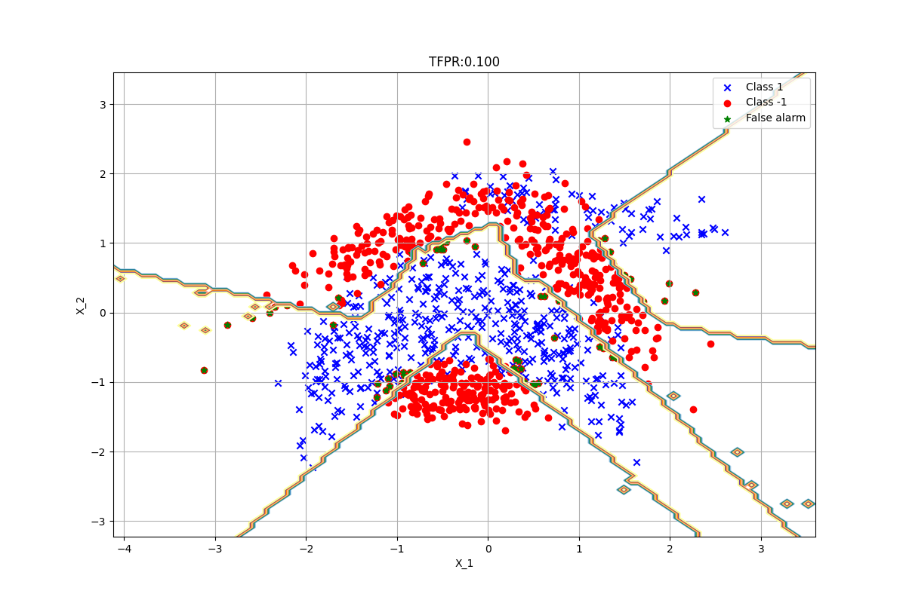

# A Neural Network Approach for Online Nonlinear Neyman-Pearson Classification
This is the repository for Online Nonlinear Neyman Pearson (NP) Classifier.  
Proposed model is an online, nonlinear, ensemble (context tree based) NP classifier. In NP framework, the target is to maximize detection power while upper-bounding the false alarm. Implemented model is compatible with sklearn's gridsearchcv function. It can be used for fine tuning. You can find example usage below. 

# Tree-OLNP parameters
    tfpr = 0.1                # target false alarm
    eta_init = 0.01           # initial learning rate for perceptron
    beta_init = 100           # initial learning rate for class weights, this is scaled by 1/total_number_of_negative_samples in code for better convergence
    sigmoid_h = -1            # sigmoid function parameter
    Lambda = 0                # regularization parameter
    tree_depth = 2            # depth of the context tree, total partition (expert) number ~ 1.5**2**tree_depth
    split_prob = 0.1          # probability of split within the context tree. Ensemble model favors simple models when the number of observed sample is low. Split prob determines the initial cost for complex models.
    node_loss_constant = 1    # learning rate for context tree framework

# Example Usage
    import pandas as pd
    from sklearn.model_selection import train_test_split, GridSearchCV
    from sklearn.metrics import confusion_matrix
    from sklearn.preprocessing import StandardScaler
    import matplotlib.pyplot as plt
    import numpy as np

    from tree_olnp.tree_olnp import tree_olnp

    # Target False Alarm
    # NP framework aims to maximize the detection power while upper bounding the false alarm rate
    # target false alarm rate should be determined by the user
    target_FPR = 0.1

    # main 
    # np-nn works for 1,-1 classification
    # we expect data to be in tabular form with the latest column as target (check ./data/banana.csv)
    data = pd.read_csv('./data/banana.csv')
    X = data.iloc[:,:-1].values
    y = data.iloc[:,-1].values

    # train test split
    X_train, X_test, y_train, y_test = train_test_split(X, y, test_size=0.2, random_state=0)

    # normalization
    sc = StandardScaler()
    X_train = sc.fit_transform(X_train)
    X_test = sc.transform (X_test)

    # define hyperparameters
    parameters = {
        'eta_init': [0.01],               # default, 0.01
        'beta_init': [100],               # default, 100
        'sigmoid_h': [-1],                # default, -1
        'Lambda':[0],                     # default, 0
        'tree_depth':[2, 6],              # default, 2
        'split_prob':[0.5],               # default, 0.5
        'node_loss_constant':[1]          # default, 1
        }

    # classifier definition
    # Note that cross validation is not applied here, it will be implemented in the future versions
    TreeOlnp = tree_olnp(tfpr = target_FPR, projection_type = 'iterative_PCA')

    # hyperparameter tuning
    clf = GridSearchCV(TreeOlnp, parameters, verbose=3, cv=2, n_jobs=-1)

    # training
    clf.fit(X_train, y_train)

    # print best params
    print(clf.best_params_)

    # get best estimator
    best_tree_olnp = clf.best_estimator_

    # plot space partition
    best_tree_olnp.test_init_partitioner(X_test)

    # prediction
    y_pred = best_tree_olnp.predict(X_test)

    # evaluation
    tn, fp, fn, tp = confusion_matrix(y_test, y_pred).ravel()
    FPR = fp/(fp+tn)
    TPR = tp/(tp+fn)
    print("Tree-OLNP, TPR: {:.3f}, FPR: {:.3f}".format(TPR, FPR))
    
# Space Partitioning
* Context tree divides the feature space in the regions.
* In each region, Tree-OLNP tries to solve a linear problem.
* Single expert is represented by different union of linear models trained in each region. (Hence Tree-OLNP is piece-wise linear, i.e nonlinear)
* Finest partition is shown below for a context tree with depth 6

# Learning Performance
* Below graph visualizes how TPR, FPR, corresponding class weights and expert weights are being updated during training.
* Note that NPNN augments data to 150k samples (shuffle + concatenation) for better convergence.

# Expected Decision Boundaries
Visualization of decision boundaries for 2D dataset. 

Thanks! 
Basarbatu Can, PhD